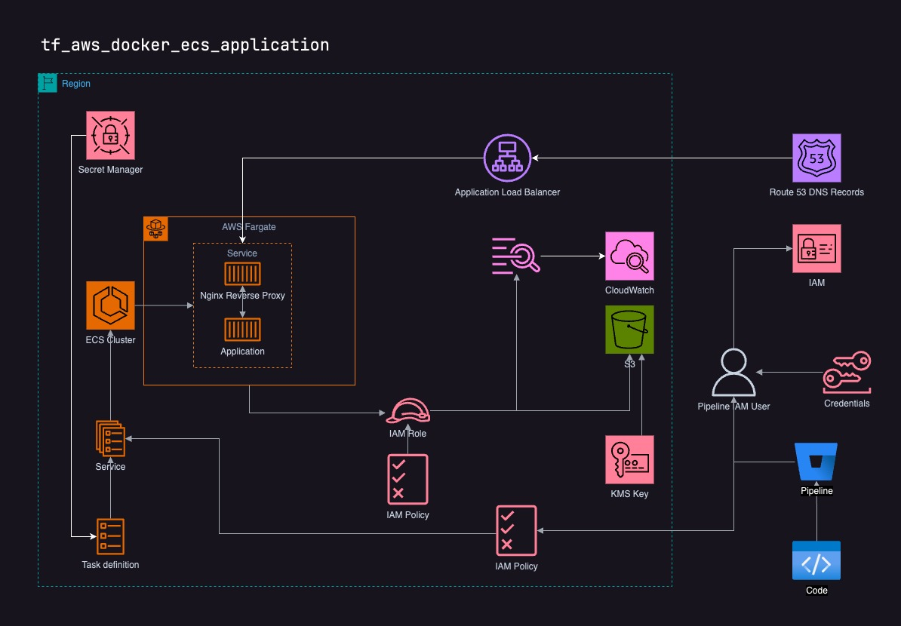

# tf_aws_docker_ecs_application

The tf_aws_docker_ecs_application repository provides Terraform scripts to deploy a Docker image on Amazon ECS as a service. It includes configurations for ECS services, task definitions, IAM roles, and CloudWatch log groups. This setup is useful for running containerized applications on AWS with minimal effort, ensuring scalability, security, and efficient resource management.

Key Features:
* ECS cluster integration
* S3 Bucket for application
* IAM roles and policies
* CI/CD Credentials for deploying application
* CloudWatch logging
* Load balancer and Route53 DNS configurations

## Security considerations
This Terraform was validated using [Trivy](https://aquasecurity.github.io/trivy/v0.52/). You'll find the report in [SECURITY](./SECURITY). 

* It's intended to allow `logs:CreateLogStream` on a given resource. So the application will bi able to create custom logs by its own.
* It's intended to have bucket versioning disabled. 

## Terraform
See [Terraform.md](./Terraform.md) for module reference.